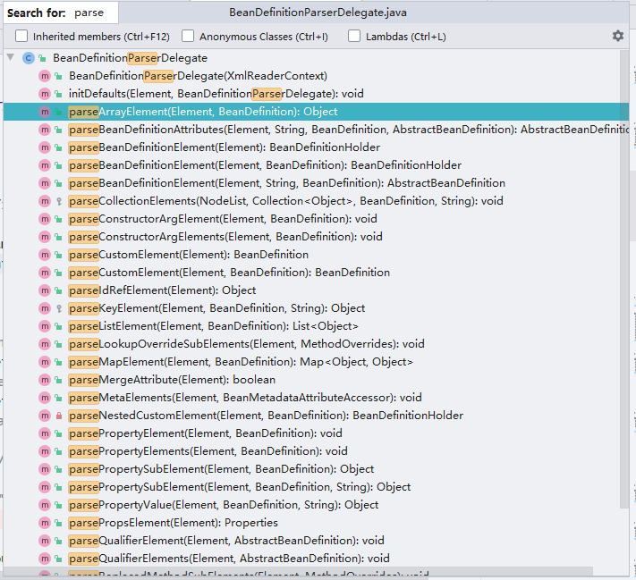
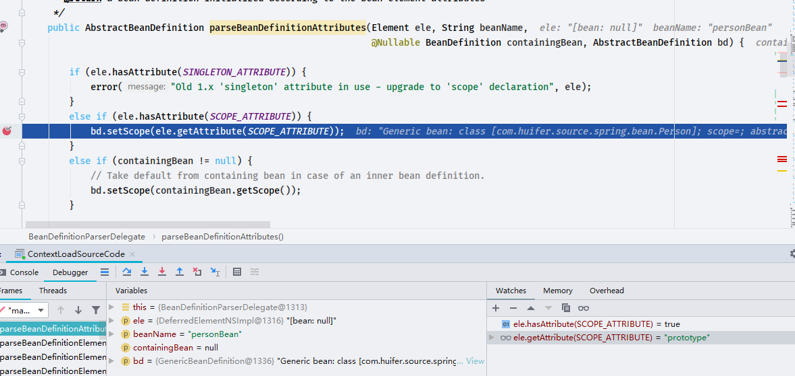

# Spring-BeanDefinitionParserDelegate
- Author: [HuiFer](https://github.com/huifer)
- 源码路径: `org.springframework.beans.factory.xml.BeanDefinitionParserDelegate`
- 该类的作用是将bean标签解析出来


- 下面这段代码是这个类的入口

```java
	@Nullable
    public BeanDefinitionHolder parseBeanDefinitionElement(Element ele, @Nullable BeanDefinition containingBean) {
        // 获取id 属性
        String id = ele.getAttribute(ID_ATTRIBUTE);
        // 获取 name 属性
        String nameAttr = ele.getAttribute(NAME_ATTRIBUTE);

        // 别名列表
        List<String> aliases = new ArrayList<>();
        if (StringUtils.hasLength(nameAttr)) {
            String[] nameArr = StringUtils.tokenizeToStringArray(nameAttr, MULTI_VALUE_ATTRIBUTE_DELIMITERS);
            aliases.addAll(Arrays.asList(nameArr));
        }

        // beanName  = <bean id=""/> 中id的属性值
        String beanName = id;
        if (!StringUtils.hasText(beanName) && !aliases.isEmpty()) {
            beanName = aliases.remove(0);
            if (logger.isTraceEnabled()) {
                logger.trace("No XML 'id' specified - using '" + beanName +
                        "' as bean name and " + aliases + " as aliases");
            }
        }

        if (containingBean == null) {
            checkNameUniqueness(beanName, aliases, ele);
        }

        // 创建对象
        AbstractBeanDefinition beanDefinition = parseBeanDefinitionElement(ele, beanName, containingBean);
        if (beanDefinition != null) {
            if (!StringUtils.hasText(beanName)) {
                try {
                    if (containingBean != null) {
                        beanName = BeanDefinitionReaderUtils.generateBeanName(
                                beanDefinition, this.readerContext.getRegistry(), true);
                    }
                    else {
                        beanName = this.readerContext.generateBeanName(beanDefinition);
                        // Register an alias for the plain bean class name, if still possible,
                        // if the generator returned the class name plus a suffix.
                        // This is expected for Spring 1.2/2.0 backwards compatibility.
                        String beanClassName = beanDefinition.getBeanClassName();
                        if (beanClassName != null &&
                                beanName.startsWith(beanClassName) && beanName.length() > beanClassName.length() &&
                                !this.readerContext.getRegistry().isBeanNameInUse(beanClassName)) {
                            aliases.add(beanClassName);
                        }
                    }
                    if (logger.isTraceEnabled()) {
                        logger.trace("Neither XML 'id' nor 'name' specified - " +
                                "using generated bean name [" + beanName + "]");
                    }
                }
                catch (Exception ex) {
                    error(ex.getMessage(), ele);
                    return null;
                }
            }
            String[] aliasesArray = StringUtils.toStringArray(aliases);
            return new BeanDefinitionHolder(beanDefinition, beanName, aliasesArray);
        }

        return null;
    }
```



该类大量的`parseXXX`开头的代码，这些方法都是对标签进行解析转换成具体的实体


## 测试用例

```xml
    <bean id="personBean" class="com.huifer.source.spring.bean.Person" scope="prototype">
        <property name="name" value="huifer"/>
        <meta key="key" value="value"/>
    </bean>

```



其他的标签也同样的方式**`getAttribute`**获取

思路: 

1. 判断是否有这个标签
   1. 有直接获取,设置值
   2. 没有跳过


## parseBeanDefinitionAttributes

- 解析属性`scope`,`abstract`,`lazy-init`

```java
public AbstractBeanDefinition parseBeanDefinitionAttributes(Element ele, String beanName,
                                                                @Nullable BeanDefinition containingBean, AbstractBeanDefinition bd) {

        if (ele.hasAttribute(SINGLETON_ATTRIBUTE)) {
            error("Old 1.x 'singleton' attribute in use - upgrade to 'scope' declaration", ele);
        }
        else if (ele.hasAttribute(SCOPE_ATTRIBUTE)) {
            bd.setScope(ele.getAttribute(SCOPE_ATTRIBUTE));
        }
        else if (containingBean != null) {
            // Take default from containing bean in case of an inner bean definition.
            bd.setScope(containingBean.getScope());
        }

        if (ele.hasAttribute(ABSTRACT_ATTRIBUTE)) {
            bd.setAbstract(TRUE_VALUE.equals(ele.getAttribute(ABSTRACT_ATTRIBUTE)));
        }

        String lazyInit = ele.getAttribute(LAZY_INIT_ATTRIBUTE);
        if (isDefaultValue(lazyInit)) {
            lazyInit = this.defaults.getLazyInit();
        }
        bd.setLazyInit(TRUE_VALUE.equals(lazyInit));

        String autowire = ele.getAttribute(AUTOWIRE_ATTRIBUTE);
        bd.setAutowireMode(getAutowireMode(autowire));

        if (ele.hasAttribute(DEPENDS_ON_ATTRIBUTE)) {
            String dependsOn = ele.getAttribute(DEPENDS_ON_ATTRIBUTE);
            bd.setDependsOn(StringUtils.tokenizeToStringArray(dependsOn, MULTI_VALUE_ATTRIBUTE_DELIMITERS));
        }

        String autowireCandidate = ele.getAttribute(AUTOWIRE_CANDIDATE_ATTRIBUTE);
        if (isDefaultValue(autowireCandidate)) {
            String candidatePattern = this.defaults.getAutowireCandidates();
            if (candidatePattern != null) {
                String[] patterns = StringUtils.commaDelimitedListToStringArray(candidatePattern);
                bd.setAutowireCandidate(PatternMatchUtils.simpleMatch(patterns, beanName));
            }
        }
        else {
            bd.setAutowireCandidate(TRUE_VALUE.equals(autowireCandidate));
        }

        if (ele.hasAttribute(PRIMARY_ATTRIBUTE)) {
            bd.setPrimary(TRUE_VALUE.equals(ele.getAttribute(PRIMARY_ATTRIBUTE)));
        }

        if (ele.hasAttribute(INIT_METHOD_ATTRIBUTE)) {
            String initMethodName = ele.getAttribute(INIT_METHOD_ATTRIBUTE);
            bd.setInitMethodName(initMethodName);
        }
        else if (this.defaults.getInitMethod() != null) {
            bd.setInitMethodName(this.defaults.getInitMethod());
            bd.setEnforceInitMethod(false);
        }

        if (ele.hasAttribute(DESTROY_METHOD_ATTRIBUTE)) {
            String destroyMethodName = ele.getAttribute(DESTROY_METHOD_ATTRIBUTE);
            bd.setDestroyMethodName(destroyMethodName);
        }
        else if (this.defaults.getDestroyMethod() != null) {
            bd.setDestroyMethodName(this.defaults.getDestroyMethod());
            bd.setEnforceDestroyMethod(false);
        }

        if (ele.hasAttribute(FACTORY_METHOD_ATTRIBUTE)) {
            bd.setFactoryMethodName(ele.getAttribute(FACTORY_METHOD_ATTRIBUTE));
        }
        if (ele.hasAttribute(FACTORY_BEAN_ATTRIBUTE)) {
            bd.setFactoryBeanName(ele.getAttribute(FACTORY_BEAN_ATTRIBUTE));
        }

        return bd;
    }
```


## parseMetaElements

```java
    /**
     * 解析Meta 元素
     * {@code <meta key="h" value="c"/>} => {@link BeanMetadataAttribute}
     * Parse the meta elements underneath the given element, if any.
     */
    public void parseMetaElements(Element ele, BeanMetadataAttributeAccessor attributeAccessor) {
        NodeList nl = ele.getChildNodes();
        for (int i = 0; i < nl.getLength(); i++) {
            Node node = nl.item(i);
            if (isCandidateElement(node) && nodeNameEquals(node, META_ELEMENT)) {
                Element metaElement = (Element) node;
                // 获取 key 属性值
                String key = metaElement.getAttribute(KEY_ATTRIBUTE);
                // 获取  value 属性值
                String value = metaElement.getAttribute(VALUE_ATTRIBUTE);
                BeanMetadataAttribute attribute = new BeanMetadataAttribute(key, value);
                attribute.setSource(extractSource(metaElement));
                attributeAccessor.addMetadataAttribute(attribute);
            }
        }
    }

```

## parseLookupOverrideSubElements

```java
    /**
     * 解析{@code <lookup-method bean="personBean2"></lookup-method>}
     * Parse lookup-override sub-elements of the given bean element.
     */
    public void parseLookupOverrideSubElements(Element beanEle, MethodOverrides overrides) {
        NodeList nl = beanEle.getChildNodes();
        for (int i = 0; i < nl.getLength(); i++) {
            Node node = nl.item(i);
            if (isCandidateElement(node) && nodeNameEquals(node, LOOKUP_METHOD_ELEMENT)) {
                Element ele = (Element) node;
                String methodName = ele.getAttribute(NAME_ATTRIBUTE);
                String beanRef = ele.getAttribute(BEAN_ELEMENT);
                // 转换成JAVA对象
                LookupOverride override = new LookupOverride(methodName, beanRef);
                override.setSource(extractSource(ele));
                overrides.addOverride(override);
            }
        }
    }

```

## parseReplacedMethodSubElements

```java
    public void parseReplacedMethodSubElements(Element beanEle, MethodOverrides overrides) {
        NodeList nl = beanEle.getChildNodes();
        for (int i = 0; i < nl.getLength(); i++) {
            Node node = nl.item(i);
            if (isCandidateElement(node) && nodeNameEquals(node, REPLACED_METHOD_ELEMENT)) {
                Element replacedMethodEle = (Element) node;
                String name = replacedMethodEle.getAttribute(NAME_ATTRIBUTE);
                String callback = replacedMethodEle.getAttribute(REPLACER_ATTRIBUTE);
                // 转换成JAVA对象
                ReplaceOverride replaceOverride = new ReplaceOverride(name, callback);
                // Look for arg-type match elements.
                List<Element> argTypeEles = DomUtils.getChildElementsByTagName(replacedMethodEle, ARG_TYPE_ELEMENT);
                for (Element argTypeEle : argTypeEles) {
                    String match = argTypeEle.getAttribute(ARG_TYPE_MATCH_ATTRIBUTE);
                    match = (StringUtils.hasText(match) ? match : DomUtils.getTextValue(argTypeEle));
                    if (StringUtils.hasText(match)) {
                        replaceOverride.addTypeIdentifier(match);
                    }
                }
                replaceOverride.setSource(extractSource(replacedMethodEle));
                overrides.addOverride(replaceOverride);
            }
        }
    }

```


## parseConstructorArgElements

```java
    public void parseConstructorArgElements(Element beanEle, BeanDefinition bd) {
        NodeList nl = beanEle.getChildNodes();
        for (int i = 0; i < nl.getLength(); i++) {
            Node node = nl.item(i);
            if (isCandidateElement(node) && nodeNameEquals(node, CONSTRUCTOR_ARG_ELEMENT)) {
                parseConstructorArgElement((Element) node, bd);
            }
        }
    }

```


## parsePropertyElements

```java
public void parsePropertyElements(Element beanEle, BeanDefinition bd) {
        NodeList nl = beanEle.getChildNodes();
        for (int i = 0; i < nl.getLength(); i++) {
            Node node = nl.item(i);
            if (isCandidateElement(node) && nodeNameEquals(node, PROPERTY_ELEMENT)) {
                parsePropertyElement((Element) node, bd);
            }
        }
    }
```


## parseQualifierElements

```java
public void parseQualifierElements(Element beanEle, AbstractBeanDefinition bd) {
        NodeList nl = beanEle.getChildNodes();
        for (int i = 0; i < nl.getLength(); i++) {
            Node node = nl.item(i);
            if (isCandidateElement(node) && nodeNameEquals(node, QUALIFIER_ELEMENT)) {
                parseQualifierElement((Element) node, bd);
            }
        }
    }
```

