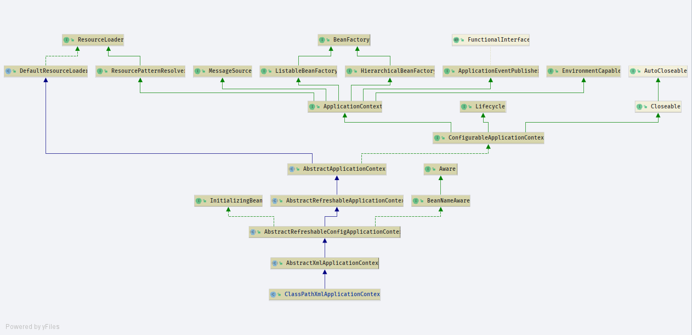
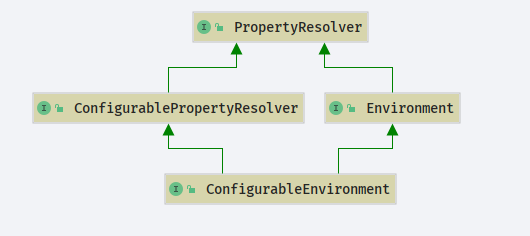
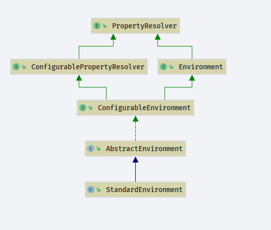
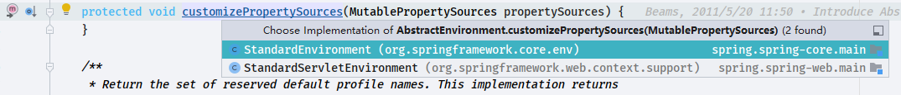
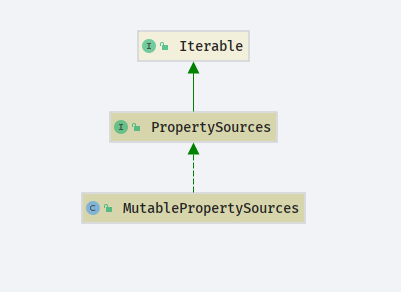
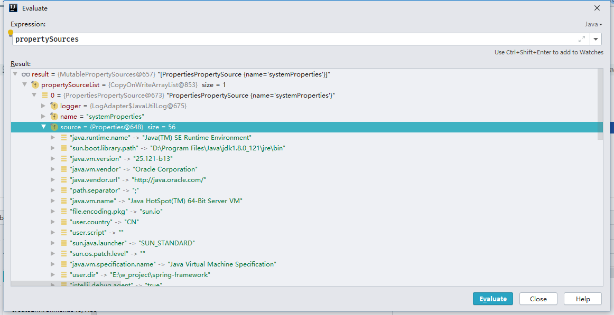
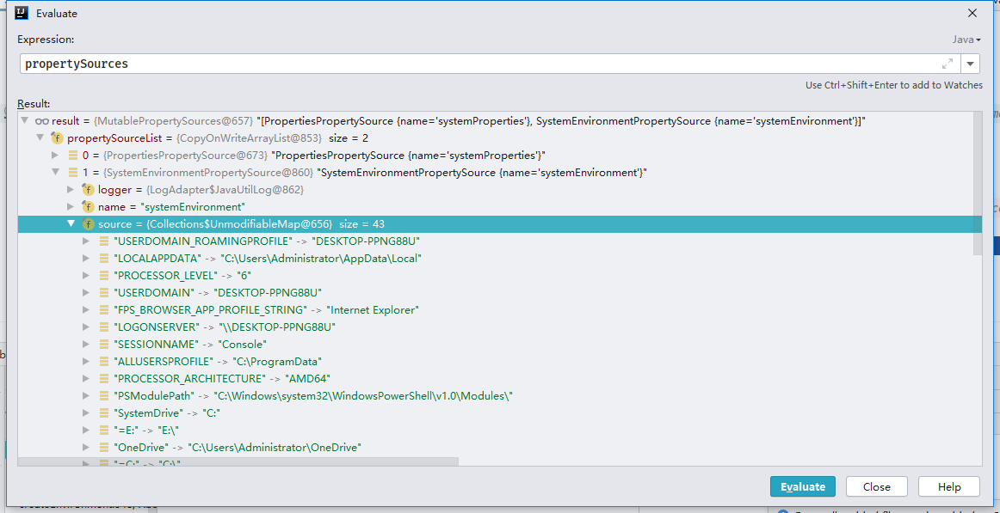

# ClassPathXmlApplicationContext

这是一段我们最开始认识spring时候的代码
```java
public class ContextLoadSourceCode {
    public static void main(String[] args) {
        // 这是一个最基本的 spring 调用的例子
        ClassPathXmlApplicationContext context = new ClassPathXmlApplicationContext("beans.xml");
        Person bean = context.getBean(Person.class);
        System.out.println(bean.getName());
    }
}
```
- 这段代码干了什么事情呢?
## 类图

## 解析
### 构造方法
- 代码从这一句话开始,它是一个构造方法,构造了一个`ClassPathXmlApplicationContext`底层做了哪些内容呢?
`ClassPathXmlApplicationContext context = new ClassPathXmlApplicationContext("beans.xml");`

```java
public ClassPathXmlApplicationContext(String configLocation) throws BeansException {
        this(new String[]{configLocation}, true, null);
    }


public ClassPathXmlApplicationContext(
            String[] configLocations, boolean refresh, @Nullable ApplicationContext parent)
            throws BeansException {

        // 调用上层`AbstractXmlApplicationContext`
        super(parent);
        setConfigLocations(configLocations);
        if (refresh) {
            refresh();
        }
    }
```
#### 参数解析
- configLocations: 本地的上下文,在本例中为`beans.xml`
- refresh: 刷新上下文,默认为`true`
- parent: 父上下文,默认`null`

### super(parent)
- `org.springframework.context.support.AbstractApplicationContext.AbstractApplicationContext(org.springframework.context.ApplicationContext)`
- 一直往下点方法,会看到
```java
public AbstractApplicationContext(@Nullable ApplicationContext parent) {
        this();
        setParent(parent);
    }
```
我们关心的重点是`setParent`方法
```java
    @Override
    public void setParent(@Nullable ApplicationContext parent) {
        this.parent = parent;
        if (parent != null) {
            Environment parentEnvironment = parent.getEnvironment();
            if (parentEnvironment instanceof ConfigurableEnvironment) {
                getEnvironment().merge((ConfigurableEnvironment) parentEnvironment);
            }
        }
    }
```
- 只有在不为空的时候才会有操作,本例不做细查
### setConfigLocations(configLocations)
- 函数作用:设置上下文内容
- `org.springframework.context.support.AbstractRefreshableConfigApplicationContext.setConfigLocations`
```java
    public void setConfigLocations(@Nullable String... locations) {
        if (locations != null) {
            Assert.noNullElements(locations, "Config locations must not be null");
            this.configLocations = new String[locations.length];
            for (int i = 0; i < locations.length; i++) {
                this.configLocations[i] = resolvePath(locations[i]).trim();
            }
        }
        else {
            this.configLocations = null;
        }
    }

```
- AbstractRefreshableConfigApplicationContext 的一个属性值
```java
    @Nullable
    private String[] configLocations;
```
- 关注一个方法`resolvePath`,解析路径


## Environment






```java
protected String resolvePath(String path) {
        return getEnvironment().resolveRequiredPlaceholders(path);
    }
```
- 此时`environment`我们还没有进行过操作他是一个`null`需要走`createEnvironment`方法
```java
@Override
    public ConfigurableEnvironment getEnvironment() {
        if (this.environment == null) {
            this.environment = createEnvironment();
        }
        return this.environment;
    }
```
- 创建环境
```java
protected ConfigurableEnvironment createEnvironment() {
        return new StandardEnvironment();
    }
```
- 这个类(StandardEnvironment)里面没有构造方法,应该在父类中
```java
public class StandardEnvironment extends AbstractEnvironment {

    public static final String SYSTEM_ENVIRONMENT_PROPERTY_SOURCE_NAME = "systemEnvironment";

    public static final String SYSTEM_PROPERTIES_PROPERTY_SOURCE_NAME = "systemProperties";

    @Override
    protected void customizePropertySources(MutablePropertySources propertySources) {
        propertySources.addLast(
                new PropertiesPropertySource(SYSTEM_PROPERTIES_PROPERTY_SOURCE_NAME, getSystemProperties()));
        propertySources.addLast(
                new SystemEnvironmentPropertySource(SYSTEM_ENVIRONMENT_PROPERTY_SOURCE_NAME, getSystemEnvironment()));
    }

}

```
- 在父类`org.springframework.core.env.AbstractEnvironment`确实找到了一个构造方法
```java
public AbstractEnvironment() {
        customizePropertySources(this.propertySources);
    }
```
- `customizePropertySources`是一个模板方法在`org.springframework.core.env.AbstractEnvironment`没有实现,交给子类去做了实现方法.


- 当前子类`StandardEnvironment`
```java
@Override
    protected void customizePropertySources(MutablePropertySources propertySources) {
        propertySources.addLast(
                new PropertiesPropertySource(SYSTEM_PROPERTIES_PROPERTY_SOURCE_NAME, getSystemProperties()));
        propertySources.addLast(
                new SystemEnvironmentPropertySource(SYSTEM_ENVIRONMENT_PROPERTY_SOURCE_NAME, getSystemEnvironment()));
    }
```

## MutablePropertySources
- `org.springframework.core.env.MutablePropertySources`

- 代码主要维护`propertySourceList`
```java
public class MutablePropertySources implements PropertySources {

    private final List<PropertySource<?>> propertySourceList = new CopyOnWriteArrayList<>();

}
```
- `customizePropertySources`方法就好理解了
```java
@Override
    protected void customizePropertySources(MutablePropertySources propertySources) {
        // 添加JVM 环境变量
        propertySources.addLast(
                new PropertiesPropertySource(SYSTEM_PROPERTIES_PROPERTY_SOURCE_NAME, getSystemProperties()));
        // 添加操作系统相关的环境变量
        propertySources.addLast(
                new SystemEnvironmentPropertySource(SYSTEM_ENVIRONMENT_PROPERTY_SOURCE_NAME, getSystemEnvironment()));
    }
```


- 加载JVM变量


- 加载系统变量



环境变量获取到了下一步.

## resolveRequiredPlaceholders

```JAVA
    protected String resolvePath(String path) {
        return getEnvironment().resolveRequiredPlaceholders(path);
    }
```

`org.springframework.core.env.AbstractEnvironment#resolveRequiredPlaceholders`

```JAVA
@Override
    public String resolveRequiredPlaceholders(String text) throws IllegalArgumentException {
        return this.propertyResolver.resolveRequiredPlaceholders(text);
    }
```

`resolveRequiredPlaceholders`

- `org.springframework.core.env.AbstractPropertyResolver#resolveRequiredPlaceholders`

```JAVA
    @Override
    public String resolveRequiredPlaceholders(String text) throws IllegalArgumentException {
        // 初始化阶段这部分内容必然为空
        if (this.strictHelper == null) {
            // 构造strictHelper
            this.strictHelper = createPlaceholderHelper(false);
        }
        // 执行解析
        return doResolvePlaceholders(text, this.strictHelper);
    }

```

