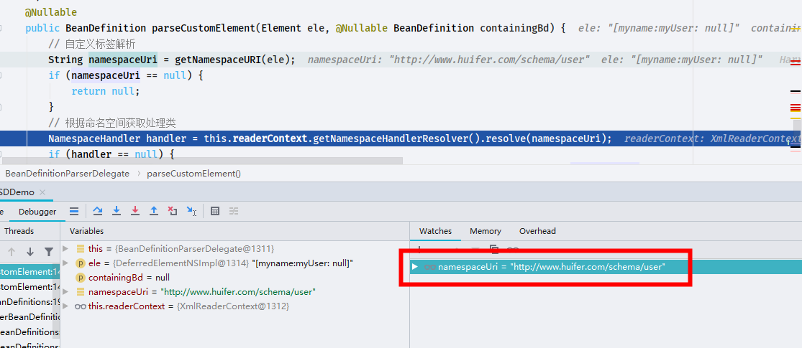
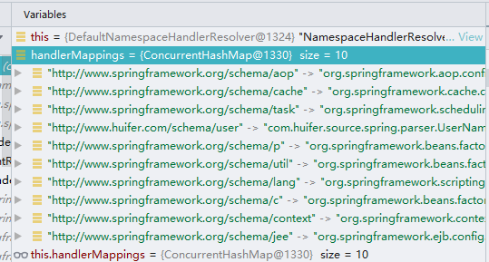
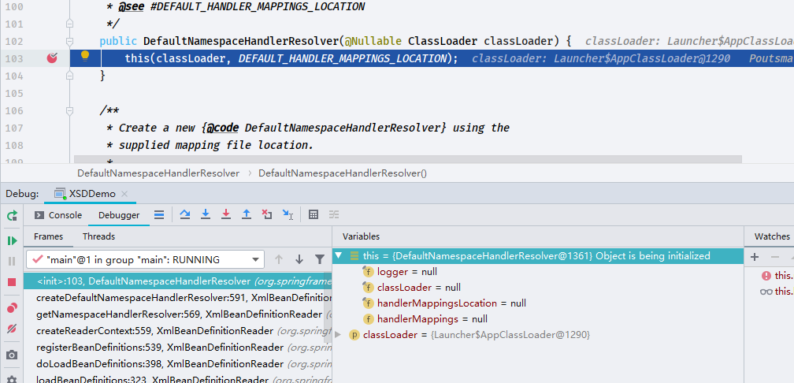
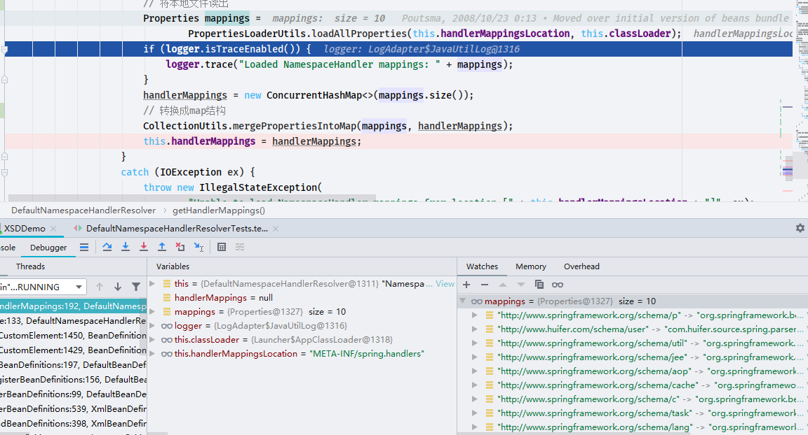
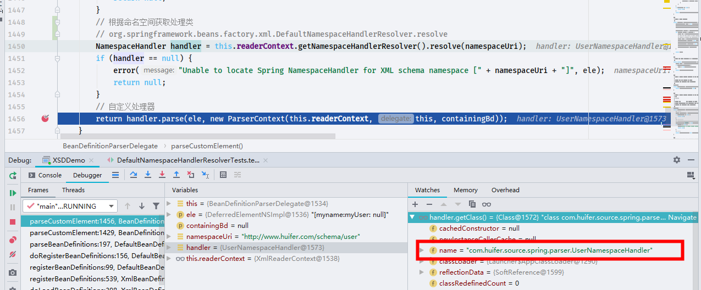
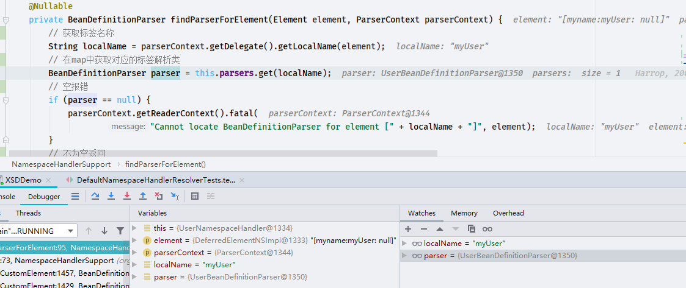
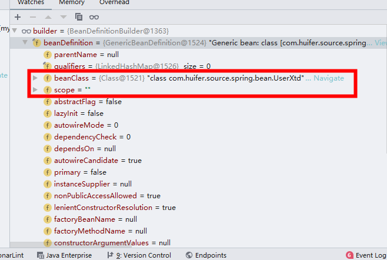

# Spring 自定义标签解析
- Author: [HuiFer](https://github.com/huifer)
- 源码阅读仓库: [huifer-spring](https://github.com/huifer/spring-framework)
- 与自定义标签解析相关的类
    1. `org.springframework.beans.factory.xml.AbstractSingleBeanDefinitionParser`
    2. `org.springframework.beans.factory.xml.NamespaceHandlerSupport`
    
- 开始源码之前先搭建一个环境


## 环境搭建
- 创建对象
```java
public class UserXtd {
    private String userName;
    private String emailAddress;

    public String getUserName() {
        return userName;
    }

    public void setUserName(String userName) {
        this.userName = userName;
    }

    public String getEmailAddress() {
        return emailAddress;
    }

    public void setEmailAddress(String emailAddress) {
        this.emailAddress = emailAddress;
    }
}
```
- 创建 xsd 文件
```xml
<?xml version="1.0" encoding="UTF-8" ?>
<schema xmlns="http://www.w3.org/2001/XMLSchema"
        targetNamespace="http://www.huifer.com/schema/user"
        elementFormDefault="qualified">

    <element name="myUser">
        <complexType>
            <attribute name="id" type="string"/>
            <attribute name="userName" type="string"/>
            <attribute name="emailAddress" type="string"/>
        </complexType>
    </element>
</schema>
```
- 创建 namespaceHandler
```java
public class UserNamespaceHandler extends NamespaceHandlerSupport {
    @Override
    public void init() {
        registerBeanDefinitionParser("myUser", new UserBeanDefinitionParser());
    }
}
```
- 创建 beanDefinitionParser
```java
public class UserBeanDefinitionParser extends AbstractSingleBeanDefinitionParser {
    /**
     * 标签对应class
     * @param element the {@code Element} that is being parsed
     * @return
     */
    @Override
    protected Class<?> getBeanClass(Element element) {
        return UserXtd.class;
    }


    @Override
    protected void doParse(Element element, ParserContext parserContext, BeanDefinitionBuilder builder) {
        // 获取 userName 标签属性值
        String name = element.getAttribute("userName");
        // 获取 emailAddress 标签属性值
        String address = element.getAttribute("emailAddress");

        if (StringUtils.hasText(name)) {
            builder.addPropertyValue("userName", name);
        }
        if (StringUtils.hasText(address)) {
            builder.addPropertyValue("emailAddress", address);
        }
    }
}

```
- 创建 resource/META-INF/spring.handlers
```text
http\://www.huifer.com/schema/user=com.huifer.source.spring.parser.UserNamespaceHandler
```
- 创建 resource/META-INF/spring.schemas
```text
http\://www.huifer.com/schema/user.xsd=META-INF/spring-test.xsd
```
- 创建测试用例xml
```xml
<?xml version="1.0" encoding="UTF-8"?>
<beans xmlns="http://www.springframework.org/schema/beans"
       xmlns:xsi="http://www.w3.org/2001/XMLSchema-instance"
       xmlns:myname="http://www.huifer.com/schema/user"
       xsi:schemaLocation="http://www.springframework.org/schema/beans http://www.springframework.org/schema/beans/spring-beans.xsd
   http://www.huifer.com/schema/user http://www.huifer.com/schema/user.xsd
">

    <myname:myUser id="testUserBean" userName="huifer" emailAddress="huifer97@163.com"/>

</beans>
```
- 创建 Java 运行方法
```java
/**
 * 自定义标签测试用例
 */
public class XSDDemo {
    public static void main(String[] args) {
        ApplicationContext applicationContext = new ClassPathXmlApplicationContext("XTD-xml.xml");
        UserXtd user = (UserXtd) applicationContext.getBean("testUserBean");
        System.out.println(user.getEmailAddress());
    }
}
```
- 这里我们希望输出结果是`huifer97@163.com`,运行后结果也确实是`huifer97@163.com`

## 解析 DefaultNamespaceHandlerResolver
- 入口方法`org.springframework.beans.factory.xml.DefaultBeanDefinitionDocumentReader.parseBeanDefinitions`
```java
    protected void parseBeanDefinitions(Element root, BeanDefinitionParserDelegate delegate) {
        if (delegate.isDefaultNamespace(root)) {
            NodeList nl = root.getChildNodes();
            for (int i = 0; i < nl.getLength(); i++) {
                Node node = nl.item(i);
                if (node instanceof Element) {
                    Element ele = (Element) node;
                    if (delegate.isDefaultNamespace(ele)) {
                        // 不同标签的解析
                        parseDefaultElement(ele, delegate);
                    }
                    else {
                        // 非spring 默认标签解析
                        delegate.parseCustomElement(ele);
                    }
                }
            }
        }
        else {
            delegate.parseCustomElement(root);
        }
    }

```
- 调用链路
- `org.springframework.beans.factory.xml.BeanDefinitionParserDelegate.parseCustomElement(org.w3c.dom.Element)`
    - `org.springframework.beans.factory.xml.BeanDefinitionParserDelegate.parseCustomElement(org.w3c.dom.Element, org.springframework.beans.factory.config.BeanDefinition)`
    
```java
    /**
     * Parse a custom element (outside of the default namespace).
     * <p>
     * 自定义标签解析
     *
     * @param ele          the element to parse
     * @param containingBd the containing bean definition (if any)
     * @return the resulting bean definition
     */
    @Nullable
    public BeanDefinition parseCustomElement(Element ele, @Nullable BeanDefinition containingBd) {
        // 自定义标签解析
        String namespaceUri = getNamespaceURI(ele);
        if (namespaceUri == null) {
            return null;
        }
        // 根据命名空间获取处理类
        NamespaceHandler handler = this.readerContext.getNamespaceHandlerResolver().resolve(namespaceUri);
        if (handler == null) {
            error("Unable to locate Spring NamespaceHandler for XML schema namespace [" + namespaceUri + "]", ele);
            return null;
        }
        // 自定义处理器
        return handler.parse(ele, new ParserContext(this.readerContext, this, containingBd));
    }

```



- `http://www.huifer.com/schema/user`和我们定义的xsd文件中的url相同，如何找到对应的NamespaceHandler,在`META-INF/spring.handlers`中有定义,

  `http\://www.huifer.com/schema/user=com.huifer.source.spring.parser.UserNamespaceHandler`

  `NamespaceHandler handler = this.readerContext.getNamespaceHandlerResolver().resolve(namespaceUri);`这行代码就是获取`spring.handlers`中的定义	

- 处理方法`org.springframework.beans.factory.xml.DefaultNamespaceHandlerResolver.resolve`


```java
    /**
     * Locate the {@link NamespaceHandler} for the supplied namespace URI
     * from the configured mappings.
     *
     * 根据 namespaceUri 获取对应的 {@link NamespaceHandler}
     * @param namespaceUri the relevant namespace URI
     * @return the located {@link NamespaceHandler}, or {@code null} if none found
     */
    @Override
    @Nullable
    public NamespaceHandler resolve(String namespaceUri) {
        // 获取handlerMapping
        Map<String, Object> handlerMappings = getHandlerMappings();
        // 从 handlerMapping 中获取类名
        Object handlerOrClassName = handlerMappings.get(namespaceUri);
        if (handlerOrClassName == null) {
            return null;
        }
        // 判断是否处理过,处理过直接返回
        else if (handlerOrClassName instanceof NamespaceHandler) {
            return (NamespaceHandler) handlerOrClassName;
        }
        else {
            // 没有处理,进行反射还原类
            String className = (String) handlerOrClassName;
            try {
                // 通过反射还原类
                Class<?> handlerClass = ClassUtils.forName(className, this.classLoader);
                if (!NamespaceHandler.class.isAssignableFrom(handlerClass)) {
                    throw new FatalBeanException("Class [" + className + "] for namespace [" + namespaceUri +
                            "] does not implement the [" + NamespaceHandler.class.getName() + "] interface");
                }
                // 初始化类
                NamespaceHandler namespaceHandler = (NamespaceHandler) BeanUtils.instantiateClass(handlerClass);
                // 调用init()方法,自定义类中实现
                namespaceHandler.init();
                // 放入缓存
                handlerMappings.put(namespaceUri, namespaceHandler);
                // 返回自定义的 namespaceHandler
                return namespaceHandler;
            }
            catch (ClassNotFoundException ex) {
                throw new FatalBeanException("Could not find NamespaceHandler class [" + className +
                        "] for namespace [" + namespaceUri + "]", ex);
            }
            catch (LinkageError err) {
                throw new FatalBeanException("Unresolvable class definition for NamespaceHandler class [" +
                        className + "] for namespace [" + namespaceUri + "]", err);
            }
        }
    }

```


- `org.springframework.beans.factory.xml.DefaultNamespaceHandlerResolver#getHandlerMappings`跟踪这个方法

```JAVA
    /**
     * Load the specified NamespaceHandler mappings lazily.
     *
     * 获取handlerMappings
     */
    private Map<String, Object> getHandlerMappings() {
        Map<String, Object> handlerMappings = this.handlerMappings;
    }
```




- 这里直接存在数据了,他是从什么时候加载的?

- `org.springframework.beans.factory.xml.XmlBeanDefinitionReader#registerBeanDefinitions`

  这个方法在注册bean定义的时候调用

  ```java
      public int registerBeanDefinitions(Document doc, Resource resource) throws BeanDefinitionStoreException {
          BeanDefinitionDocumentReader documentReader = createBeanDefinitionDocumentReader();
          int countBefore = getRegistry().getBeanDefinitionCount();
          // 注册方法
          // createReaderContext 初始化HandlerMapping
          documentReader.registerBeanDefinitions(doc, createReaderContext(resource));
          return getRegistry().getBeanDefinitionCount() - countBefore;
      }
  
  ```

- 继续跟踪`createReaderContext`

  ```java
  org.springframework.beans.factory.xml.XmlBeanDefinitionReader#createReaderContext
  ```

  ```java
      public XmlReaderContext createReaderContext(Resource resource) {
          return new XmlReaderContext(resource, this.problemReporter, this.eventListener,
                  this.sourceExtractor, this, getNamespaceHandlerResolver());
      }
  
  ```

- 继续跟踪`getNamespaceHandlerResolver`

  `org.springframework.beans.factory.xml.XmlBeanDefinitionReader#getNamespaceHandlerResolver`

  ```java
      public NamespaceHandlerResolver getNamespaceHandlerResolver() {
          if (this.namespaceHandlerResolver == null) {
              this.namespaceHandlerResolver = createDefaultNamespaceHandlerResolver();
          }
          return this.namespaceHandlerResolver;
      }
  
  ```

- 继续跟踪`createDefaultNamespaceHandlerResolver`

  `org.springframework.beans.factory.xml.XmlBeanDefinitionReader#createDefaultNamespaceHandlerResolver`

  ```java
  protected NamespaceHandlerResolver createDefaultNamespaceHandlerResolver() {
          ClassLoader cl = (getResourceLoader() != null ? getResourceLoader().getClassLoader() : getBeanClassLoader());
          return new DefaultNamespaceHandlerResolver(cl);
      }
  ```

  

- 继续跟踪`DefaultNamespaceHandlerResolver`

  `org.springframework.beans.factory.xml.DefaultNamespaceHandlerResolver`

  ```java
      public DefaultNamespaceHandlerResolver(@Nullable ClassLoader classLoader) {
          this(classLoader, DEFAULT_HANDLER_MAPPINGS_LOCATION);
      }
  
  ```

  他回到了我们之前疑问的地方 `handlerMappings` 如何出现的

  断点

  

  ```JAVA
      public DefaultNamespaceHandlerResolver(@Nullable ClassLoader classLoader) {
          this(classLoader, DEFAULT_HANDLER_MAPPINGS_LOCATION);
      }
  ```

  `public static final String DEFAULT_HANDLER_MAPPINGS_LOCATION = "META-INF/spring.handlers";`

  

  此时还是空

  走完

  

  ```java
      @Override
      public String toString() {
          return "NamespaceHandlerResolver using mappings " + getHandlerMappings();
      }
  
  ```


```JAVA
    /**
     * Load the specified NamespaceHandler mappings lazily.
     *
     * 获取handlerMappings
     */
    private Map<String, Object> getHandlerMappings() {
        Map<String, Object> handlerMappings = this.handlerMappings;
        // 缓存不存在
        if (handlerMappings == null) {
            synchronized (this) {
                handlerMappings = this.handlerMappings;
                if (handlerMappings == null) {
                    if (logger.isTraceEnabled()) {
                        logger.trace("Loading NamespaceHandler mappings from [" + this.handlerMappingsLocation + "]");
                    }
                    try {
                        // 将本地文件读出
                        Properties mappings =
                                PropertiesLoaderUtils.loadAllProperties(this.handlerMappingsLocation, this.classLoader);
                        if (logger.isTraceEnabled()) {
                            logger.trace("Loaded NamespaceHandler mappings: " + mappings);
                        }
                        handlerMappings = new ConcurrentHashMap<>(mappings.size());
                        // 转换成map结构
                        CollectionUtils.mergePropertiesIntoMap(mappings, handlerMappings);
                        this.handlerMappings = handlerMappings;
                    }
                    catch (IOException ex) {
                        throw new IllegalStateException(
                                "Unable to load NamespaceHandler mappings from location [" + this.handlerMappingsLocation + "]", ex);
                    }
                }
            }
        }
        return handlerMappings;
    }

```




## org.springframework.beans.factory.xml.DefaultNamespaceHandlerResolver#resolve

```java
    @Override
    @Nullable
    public NamespaceHandler resolve(String namespaceUri) {
        // 获取handlerMapping
        Map<String, Object> handlerMappings = getHandlerMappings();
        // 从 handlerMapping 中获取类名
        Object handlerOrClassName = handlerMappings.get(namespaceUri);
        if (handlerOrClassName == null) {
            return null;
        }
        // 判断是否处理过,处理过直接返回
        else if (handlerOrClassName instanceof NamespaceHandler) {
            return (NamespaceHandler) handlerOrClassName;
        }
        else {
            // 没有处理,进行反射还原类
            String className = (String) handlerOrClassName;
            try {
                // 通过反射还原类
                Class<?> handlerClass = ClassUtils.forName(className, this.classLoader);
                if (!NamespaceHandler.class.isAssignableFrom(handlerClass)) {
                    throw new FatalBeanException("Class [" + className + "] for namespace [" + namespaceUri +
                            "] does not implement the [" + NamespaceHandler.class.getName() + "] interface");
                }
                // 初始化类
                NamespaceHandler namespaceHandler = (NamespaceHandler) BeanUtils.instantiateClass(handlerClass);
                // 调用init()方法,自定义类中实现
                namespaceHandler.init();
                // 放入缓存
                handlerMappings.put(namespaceUri, namespaceHandler);
                // 返回自定义的 namespaceHandler
                return namespaceHandler;
            }
            catch (ClassNotFoundException ex) {
                throw new FatalBeanException("Could not find NamespaceHandler class [" + className +
                        "] for namespace [" + namespaceUri + "]", ex);
            }
            catch (LinkageError err) {
                throw new FatalBeanException("Unresolvable class definition for NamespaceHandler class [" +
                        className + "] for namespace [" + namespaceUri + "]", err);
            }
        }
    }

```

执行`init`方法

```java
public class UserNamespaceHandler extends NamespaceHandlerSupport {
    @Override
    public void init() {
        registerBeanDefinitionParser("myUser", new UserBeanDefinitionParser());
    }
}
```

```java
    /**
     * Subclasses can call this to register the supplied {@link BeanDefinitionParser} to
     * handle the specified element. The element name is the local (non-namespace qualified)
     * name.
     *
     * 将标签名称,标签解析类放入
     */
    protected final void registerBeanDefinitionParser(String elementName, BeanDefinitionParser parser) {
        this.parsers.put(elementName, parser);
    }

```


- 方法走完，回到开始的方法

  ```java
      /**
       * Parse a custom element (outside of the default namespace).
       * <p>
       * 自定义标签解析
       *
       * @param ele          the element to parse
       * @param containingBd the containing bean definition (if any)
       * @return the resulting bean definition
       */
      @Nullable
      public BeanDefinition parseCustomElement(Element ele, @Nullable BeanDefinition containingBd) {
          // 自定义标签解析
          String namespaceUri = getNamespaceURI(ele);
          if (namespaceUri == null) {
              return null;
          }
          // 根据命名空间获取处理类
          // org.springframework.beans.factory.xml.DefaultNamespaceHandlerResolver.resolve
          NamespaceHandler handler = this.readerContext.getNamespaceHandlerResolver().resolve(namespaceUri);
          if (handler == null) {
              error("Unable to locate Spring NamespaceHandler for XML schema namespace [" + namespaceUri + "]", ele);
              return null;
          }
          // 自定义处理器
          return handler.parse(ele, new ParserContext(this.readerContext, this, containingBd));
      }
  
  ```

  




## org.springframework.beans.factory.xml.NamespaceHandler#parse

- `org.springframework.beans.factory.xml.NamespaceHandlerSupport.parse`

  ```java
      @Override
      @Nullable
      public BeanDefinition parse(Element element, ParserContext parserContext) {
          BeanDefinitionParser parser = findParserForElement(element, parserContext);
          return (parser != null ? parser.parse(element, parserContext) : null);
      }
  
  ```

### org.springframework.beans.factory.xml.NamespaceHandlerSupport#findParserForElement

```java
    @Nullable
    private BeanDefinitionParser findParserForElement(Element element, ParserContext parserContext) {
        // 获取标签名称
        String localName = parserContext.getDelegate().getLocalName(element);
        // 在map中获取对应的标签解析类
        BeanDefinitionParser parser = this.parsers.get(localName);
        // 空报错
        if (parser == null) {
            parserContext.getReaderContext().fatal(
                    "Cannot locate BeanDefinitionParser for element [" + localName + "]", element);
        }
        // 不为空返回
        return parser;
    }

```



### org.springframework.beans.factory.xml.BeanDefinitionParser#parse

- `org.springframework.beans.factory.xml.AbstractBeanDefinitionParser#parse`

```java
    public final BeanDefinition parse(Element element, ParserContext parserContext) {
        /**
         * {@link AbstractSingleBeanDefinitionParser#parseInternal(org.w3c.dom.Element, org.springframework.beans.factory.xml.ParserContext)}
         */
        AbstractBeanDefinition definition = parseInternal(element, parserContext);
       
        
    }
```

### org.springframework.beans.factory.xml.AbstractSingleBeanDefinitionParser#parseInternal

```java
@Override
    protected final AbstractBeanDefinition parseInternal(Element element, ParserContext parserContext) {
        BeanDefinitionBuilder builder = BeanDefinitionBuilder.genericBeanDefinition();
        String parentName = getParentName(element);
        if (parentName != null) {
            builder.getRawBeanDefinition().setParentName(parentName);
        }
        // 调用自己实现的方法 com.huifer.source.spring.parser.UserBeanDefinitionParser.getBeanClass
        Class<?> beanClass = getBeanClass(element);
        if (beanClass != null) {
            builder.getRawBeanDefinition().setBeanClass(beanClass);
        }
        else {
            // getBeanClassName 同样也是可以在自定义的解析类中实现
            String beanClassName = getBeanClassName(element);
            if (beanClassName != null) {
                builder.getRawBeanDefinition().setBeanClassName(beanClassName);
            }
        }
        builder.getRawBeanDefinition().setSource(parserContext.extractSource(element));
        BeanDefinition containingBd = parserContext.getContainingBeanDefinition();
        if (containingBd != null) {
            // Inner bean definition must receive same scope as containing bean.
            // 设置scope
            builder.setScope(containingBd.getScope());
        }
        if (parserContext.isDefaultLazyInit()) {
            // Default-lazy-init applies to custom bean definitions as well.
            // 设置 lazy-init
            builder.setLazyInit(true);
        }

        // 执行解析方法,在自定义解析类中存在com.huifer.source.spring.parser.UserBeanDefinitionParser.doParse
        doParse(element, parserContext, builder);
        return builder.getBeanDefinition();
    }
```




执行`com.huifer.source.spring.parser.UserBeanDefinitionParser#doParse`

```JAVA
@Override
    protected void doParse(Element element, ParserContext parserContext, BeanDefinitionBuilder builder) {
        // 获取 userName 标签属性值
        String name = element.getAttribute("userName");
        // 获取 emailAddress 标签属性值
        String address = element.getAttribute("emailAddress");

        if (StringUtils.hasText(name)) {
            builder.addPropertyValue("userName", name);
        }
        if (StringUtils.hasText(address)) {
            builder.addPropertyValue("emailAddress", address);
        }
    }
```


